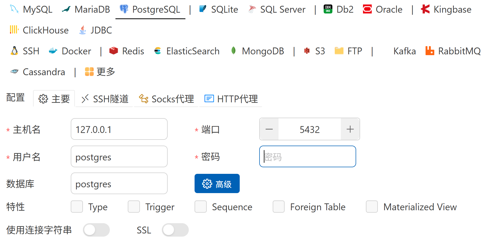

### 认识项目结构

- 本项目是基于`Spring Boot Maven`框架的项目
- 项目根目录下, 最重要的是`src`, `.gitignore`, `pom.xml`
  - `src`: 顾名思义, 源代码; 其下`main`目录为项目代码, `test`目录为测试代码

    一长串文件夹源于`java`的包管理机制

    总之, 本项目预期地把大作业分为四个模块来实现, 分别是`cli`, `dao`, `entity`, `utils`

    `entity`: 里面所有的类都用于关联数据库中的实体

    `dao`: 里面所有的类和方法都用于实现`dao`接口, 这个接口提供便捷访问数据库的一系列方法, 最主要的任务是编写`sql`语句

    `utils`: 提供面向业务的接口, 通过调用`dao`提供的接口实现一些业务逻辑

    `cli`: 为用户提供友好的命令行界面, 由`cli`处理和解析用户的输入

  - `.gitignore`: 顾名思义是被`git`忽视的文件或目录, 例如可执行文件所属目录`target`等

  - `pom.xml`: 用`xml`语言描述的项目配置, 最重要的是设置依赖项

  在`<dependencies>`标签内可以引入依赖包, 包名和项目名均可以上网查找

  ```xml
  <dependency>
  <groupId>包名</groupId>
  <artifactId>项目名</artifactId>
  </dependency>
  ```

- `src/main`目录下的`resources`目录包含一些静态资源文件, 初始时包含`application.properties`, 即配置项

  在本项目主要需要认识`postgres`数据库的相关配置

  ```properties
  # PostgreSQL
  spring.datasource.url=jdbc:postgresql://localhost:5432/jhomework
  spring.datasource.username=pa_admin
  spring.datasource.password=jhomework@123
  spring.datasource.driver-class-name=org.postgresql.Driver
  
  # JPA
  spring.jpa.hibernate.ddl-auto=update
  spring.jpa.properties.hibernate.dialect=org.hibernate.dialect.PostgreSQLDialect
  spring.jpa.show-sql=true
  spring.jpa.properties.hibernate.default_schema=jhomework
  ```

  其中, `url`为数据库的`url`, 例如`jdbc:postgresql://localhost:5432/jhomework`表示由`jdbc`(`Java Database Connection`)驱动的本机的`5432`端口的`jhomework`数据库

  `username`为登录的用户名, `password`为该用户的密码

  驱动类是固定的, 名为`org.postgresql.Driver`

  最后一行`default_schema`表示默认连接上`jhomework`模式

### 关于数据库的说明

- 我没有钱买个人云服务器, 所以用的是本机的数据库, 所以克隆仓库后肯定是运行不了的

  应该在你们的主机上安装`postgreSQL`服务, 然后我这里提供俩脚本给你们
- 先以默认的`postgres`(超管)用户登录默认的`postgres`数据库, 这里用的是`VSCode`上的`CodeLLDB`插件来连接, 使用其它客户端应用也可

  

  在此连接下的`postgres`数据库中创建一个`sql`脚本, 运行

  ```sql
  CREATE USER pa_admin WITH
    PASSWORD 'jhomework@123'
    NOSUPERUSER
    NOCREATEDB
    NOREPLICATION
    NOCREATEROLE
    NOINHERIT;
  
  CREATE DATABASE jhomework ENCODING = 'UTF8';
  ```

  上述脚本的目的是创建一个名为`pa_admin`的用户, 它没有超管权限、创建数据库权限、创建用户权限, 密码为`jhomework@123`, 然后创建一个名为`jhomework`的数据库
- 在新建的`jhomework`数据库中创建一个新的`sql`脚本, 继续执行以下脚本

  ```sql
  CREATE SCHEMA jhomework;
  GRANT USAGE ON SCHEMA jhomework TO pa_admin;
  
  GRANT ALL PRIVILEGES ON ALL TABLES IN SCHEMA jhomework TO pa_admin;
  GRANT ALL PRIVILEGES ON ALL SEQUENCES IN SCHEMA jhomework TO pa_admin;
  GRANT ALL PRIVILEGES ON ALL FUNCTIONS IN SCHEMA jhomework TO pa_admin;
  GRANT ALL PRIVILEGES ON ALL PROCEDURES IN SCHEMA jhomework TO pa_admin;
  
  GRANT CREATE ON SCHEMA jhomework TO pa_admin;
  
  ALTER DEFAULT PRIVILEGES IN SCHEMA jhomework
  GRANT ALL PRIVILEGES ON TABLES TO pa_admin;
  ALTER DEFAULT PRIVILEGES IN SCHEMA jhomework
  GRANT ALL PRIVILEGES ON SEQUENCES TO pa_admin;
  ALTER DEFAULT PRIVILEGES IN SCHEMA jhomework
  GRANT ALL PRIVILEGES ON FUNCTIONS TO pa_admin;
  ALTER DEFAULT PRIVILEGES IN SCHEMA jhomework
  GRANT ALL PRIVILEGES ON TYPES TO pa_admin;
  
  REVOKE ALL ON SCHEMA public FROM pa_admin;
  ```

  上述脚本的目的是在`jhomework`数据库中创建一个名为`jhomework`的模式, 并将这个模式的所有`ddl`, `dml`权限交给用户`pa_admin`, 然后剥夺`pa_admin`对`public`模式的所有权限

  这样可以保证用户`pa_admin`只能管理`jhomework`这个私有模式

### 其它问题

- 配置好数据库后, 起码能够运行`2025-6-24`之前提交的代码了, 如果不行, 看看是否是以下问题
- `JDK`版本不对, 应是`JDK 21`
- `$JAVA_HOME`配置不对
- 本机数据库服务未开启
- 没有安装必要的插件