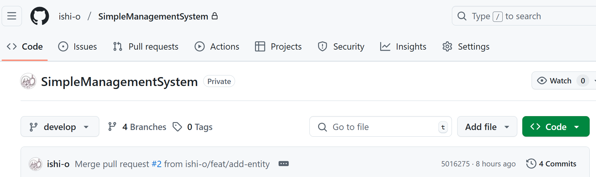
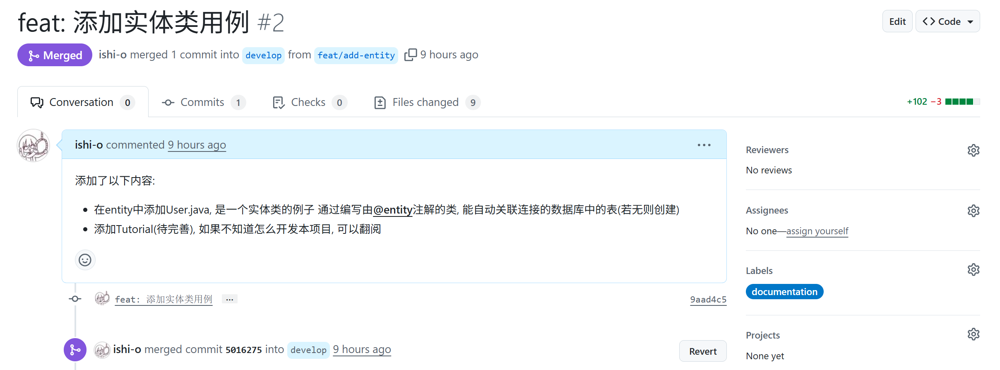

## 速成`github`

- 先点击个人头像中的`Your reposity`, 进入仓库主页
- 

  其中, `code`为代码页面, 在下面可以看到分支`develop`以及绿色的`<>Code`按钮

  仓库地址从绿色按钮中获得, 即一个带`.git`的`url`链接
- 分支: 一般开发中, 通常会创建多个子分支`feat/xxx`, 完成`xxx`功能后**合并**到`develop`分支中

  你可以认为一个分支就是一个**指针**, **指向**某一个**成功提交的修改**

  提交一次更改, 就是创建了一个成功修改, 并使当前分支指向这个新的修改
  
  `HEAD`是一个指向分支的指针, 指向当前所在分支

- 其中`Pull requests`是拉取请求, 例如, 协作者把项目`fork`到本地仓库后修改`feat/xxx`分支, 然后`push`到远程仓库上的`feat/xxx`分支后, 需要创建`PR`请求`develop`把`feat/xxx`"拉回去"(即合并), 由开发团队审核确认该`PR`通过
- 如何创建`PR`: 
  
  创建`PR`最重要的是确认**合并的分支(箭头指向的分支)**和新增的分支

  
  
  这是一个创建好并通过的`PR`, `Conversation`是讨论(其它审核可以在此发表评论), `Commits`是提交概括(包括发起者编写的`message`), `Files changed`是具体的修改内容, 右侧可以添加`Labels`
- 仓库管理者、含写权限的协作者对没被保护的分支能够自行通过`PR`

## 速成`git`

- 记住，每一次修改或提交前，**一定一定先`fetch+merge`远程仓库的`develop`**，同步最新的`develop`分支

  在本项目因为开发人员比较少，可以不用经常同步

- 先安装`git`

- `cd`到一个空目录下

- `git config --global user.email`: 确定现在所用`git`的邮箱, 一定保证是`github`账号上绑定的邮箱

- `git commit --amend --author="用户名 <邮箱>`: 设置提交时, 用户名及邮箱

- `git clone 仓库地址`: 克隆远程仓库

- `git remote add origin 仓库地址`: 将本地仓库关联到远程仓库

- `git fetch origin`: 将远程仓库上的修改下载到本地的远程仓库区

- `git log -p 分支1..分支2`: 查看分支1和分支2的区别

- `git merge 分支1`: 将分支1合并到当前分支

- `git pull`: 你可以查到这个命令, 但我不推荐使用

- `git branch`: 查看所有本地分支, `*`所指为当前所在分支

- `git branch new_branch`: 创建一个名为`new_branch`的新分支

- `git checkout new_branch`: 切换到名为`new_branch`的分支中，也可以添加`-b`参数，在`new_branch`不存在时创建，然后切换分支

- `git add .`: 将所有更改添加到暂存区

- `git commit -m "注释"`: 将暂存区的更改提交

- `git push -u origin branch名`: 将本地分支推送到远程仓库的`branch名`分支上

  推送后, 可以在`github`上创建一个`PR`并审核通过, 此后合并成功

- `git branch --delete branch名`: 删除本地仓库的名为`branch名`的分支

- `git push origin --delete branch名`: 删除远程仓库上的`branch名`分支(误推送可以删除)

- `git reset`: 回退, 分三种(`soft`, `mixed`, `hard`, `mixed`为默认)
  
  - `git reset HEAD~x`: 回退当前分支的所有**暂存区的修改**到前`x`个提交(误`add`)
  
  - `git reset --soft HEAD~x`: 回退当前分支的**提交记录**到前`x`个提交
  
  - `git reset --hard HEAD~x`: 回退当前分支的所有**暂存区和工作区的修改**到前`x`个提交
  
  - `git reset HEAD~x file`: 仅回退`file`的暂存区修改
  
  - `git reset HEAD^`: 等价于`git reset HEAD~1`
  
- 如果你不小心在错误的分支上开发功能，想把现在的更改迁移到新的分支上，你可以：
  ```shell
  git stash push -u
  git checkout -b 新分支			# -b: 若没有该分支则创建
  git stash pop
  ```
  
  这相当于将当前工作区及暂存区的更改推入栈中，暂时地清空工作区及暂存区，然后使用`pop`即可

